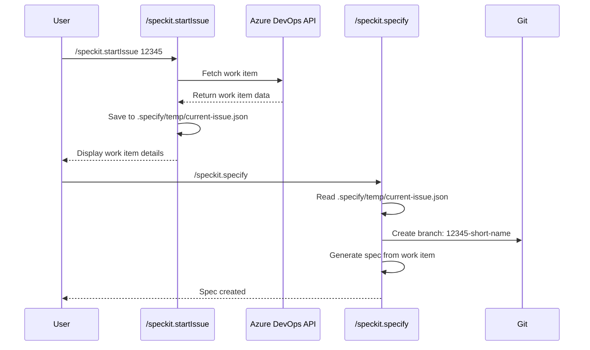

# Azure DevOps Integration

Spec Kit includes built-in integration with Azure DevOps, allowing you to automatically fetch work item information and use it to drive your specification process.

## Overview

The Azure DevOps integration provides two key benefits:

1. **Automatic work item synchronization**: Fetch work item details (title, description, acceptance criteria) directly from Azure DevOps
2. **Linked branches**: Create branches named after work item IDs, making it easy to track which branch implements which work item

## Workflow



## Setup

### 1. Configure Azure DevOps Connection

Create a `.specify/config.json` file in your repository root.

**Quick Setup:**

```bash
# Copy the example config
cp .specify-config.example.json .specify/config.json

# Edit and fill in your details
# organization: Your Azure DevOps organization name
# project: Your Azure DevOps project name
```

**Manual Setup:**

Create `.specify/config.json`:

```json
{
  "azureDevOps": {
    "enabled": true,
    "organization": "your-organization",
    "project": "your-project",
    "apiVersion": "7.1"
  },
  "branchNaming": {
    "useWorkItemId": true
  },
  "features": {
    "autoArchiveIssues": true
  }
}
```

**Example:**
- If your Azure DevOps URL is `https://dev.azure.com/contoso/MyProject`
- Organization: `contoso`
- Project: `MyProject`

For detailed configuration options, see the [Configuration Setup Guide](./config-setup.md).

### 2. Authentication

Choose one of two authentication methods:

#### Option 1: Personal Access Token (Recommended)

1. Create a PAT in Azure DevOps:
   - Go to Azure DevOps → User Settings → Personal Access Tokens
   - Click "New Token"
   - Give it a name (e.g., "Spec Kit Integration")
   - Select scope: **Work Items (Read)**
   - Set expiration as needed
   - Copy the generated token

2. Set the environment variable:

   **Bash/Zsh:**
   ```bash
   export AZURE_DEVOPS_PAT="your-pat-token-here"
   ```

   **PowerShell:**
   ```powershell
   $env:AZURE_DEVOPS_PAT = "your-pat-token-here"
   ```

   **Persistent (add to ~/.bashrc or ~/.zshrc):**
   ```bash
   echo 'export AZURE_DEVOPS_PAT="your-pat-token-here"' >> ~/.bashrc
   source ~/.bashrc
   ```

#### Option 2: Azure CLI

If you have Azure CLI installed and configured:

```bash
az login
```

The integration will automatically use Azure CLI credentials as a fallback if `AZURE_DEVOPS_PAT` is not set.

## Usage

### Step 1: Fetch Work Item

Use `/speckit.startIssue` with your work item ID:

```
/speckit.startIssue 12345
```

This will:
- Fetch the work item from Azure DevOps
- Display the work item details (ID, Type, Title, State, Description, Acceptance Criteria)
- Save the data to `.specify/temp/current-issue.json`

**Example output:**
```
✓ Work item fetched successfully!

ID:    12345
Type:  User Story
Title: Add user authentication system
State: Active

Saved to: .specify/temp/current-issue.json

Next step: Run /speckit.specify to create the specification
```

### Step 2: Create Specification

Run `/speckit.specify` without arguments (or with additional context):

```
/speckit.specify
```

Or with additional context:
```
/speckit.specify Use OAuth2 with JWT tokens for authentication
```

This will:
- Read the saved work item data from `.specify/temp/current-issue.json`
- Create a branch named: `{work-item-id}-{sanitized-title}` (e.g., `12345-user-auth`)
- Generate a specification using:
  - Work item title as the feature name
  - Work item description as the feature description
  - Acceptance criteria as part of the requirements
  - Any additional context you provided

### Step 3: Continue with Normal Workflow

After `/speckit.specify` completes, continue with the standard Spec Kit workflow:

```
/speckit.plan
/speckit.tasks
/speckit.implement
```

## Branch Naming

### With Azure DevOps Integration

When using `/speckit.startIssue`, branches are named:
```
{work-item-id}-{sanitized-title}
```

**Examples:**
- Work item #12345 "Add user authentication" → `12345-user-auth`
- Work item #67890 "Fix payment processing bug" → `67890-fix-payment-bug`
- Work item #11111 "Implement OAuth2 API integration" → `11111-oauth2-api-integration`

### Without Azure DevOps Integration

Standard Spec Kit behavior uses auto-incremented numbers:
```
{auto-number}-{sanitized-title}
```

**Examples:**
- "Add user authentication" → `001-user-auth`
- "Fix payment processing bug" → `002-fix-payment-bug`

## Work Item Types

The integration supports all Azure DevOps work item types:

- User Story
- Task
- Bug
- Feature
- Epic
- Issue
- Test Case
- And any custom work item types

## Troubleshooting

### Configuration Error

```
Error: Configuration file not found at .specify/config.json
```

**Solution:** Create `.specify/config.json` with your organization and project:
```json
{
  "azureDevOps": {
    "organization": "your-org",
    "project": "your-project"
  }
}
```

### Authentication Error

```
Error: No authentication method available
```

**Solution:** Either:
1. Set `AZURE_DEVOPS_PAT` environment variable with your Personal Access Token
2. Install Azure CLI and run `az login`

### Work Item Not Found

```
Error: Failed to fetch work item (HTTP 404)
```

**Solution:**
- Verify the work item ID exists
- Ensure you have access to the work item
- Check that your PAT has "Work Items (Read)" permissions

### jq Not Installed (Bash only)

```
Error: jq is required but not installed
```

**Solution:** Install jq:
- **macOS:** `brew install jq`
- **Ubuntu/Debian:** `apt-get install jq`
- **Windows (WSL):** `apt-get install jq`

## Advanced Usage

### Manual Work Item File

If you prefer not to use the API, you can manually create `.specify/temp/current-issue.json`:

```json
{
  "id": "12345",
  "type": "User Story",
  "title": "Add user authentication system",
  "description": "As a user, I want to securely log in...",
  "state": "Active",
  "assignedTo": "John Doe",
  "acceptanceCriteria": "- Users can register\n- Users can login\n- Passwords are encrypted",
  "fetchedAt": "2024-01-15T10:30:00Z"
}
```

Then run `/speckit.specify` as normal.

### Multiple Work Items

To work on multiple work items in sequence:

1. Fetch first work item: `/speckit.startIssue 12345`
2. Create spec: `/speckit.specify`
3. Complete workflow: `/speckit.plan`, `/speckit.tasks`, `/speckit.implement`
4. Fetch next work item: `/speckit.startIssue 67890`
5. Repeat...

Each `/speckit.startIssue` overwrites the previous work item data, ensuring clean separation between features.

## Integration with Azure Boards

The branch naming convention (`{work-item-id}-{title}`) makes it easy to:

1. **Link commits to work items**: Azure DevOps automatically links commits that mention `#12345` or `AB#12345`
2. **Track progress**: See which branches are implementing which work items
3. **PR automation**: Create PRs that automatically link to work items
4. **Status updates**: Configure Azure Boards to update work item status when PRs merge

## Security Considerations

- **PAT Permissions**: Only grant "Work Items (Read)" scope - no write permissions needed
- **PAT Storage**: Never commit your PAT to git. Use environment variables only
- **PAT Expiration**: Set reasonable expiration dates and rotate regularly
- **Config File**: The `.specify/config.json` can be committed (it contains no secrets)
- **Temp Files**: The `.specify/temp/` directory is temporary and should be in `.gitignore`

## Example .gitignore

```gitignore
# Spec Kit temporary files
.specify/temp/
```

## FAQ

**Q: Can I use this with Azure DevOps Server (on-premises)?**
A: Yes, but you'll need to modify the API URL in the scripts to point to your on-premises server.

**Q: What if I want to use a different work item field?**
A: You can modify the scripts (`fetch-azure-issue.sh` / `fetch-azure-issue.ps1`) to fetch additional or different fields.

**Q: Can I skip `/speckit.startIssue` and use `/speckit.specify` directly?**
A: Yes! The Azure DevOps integration is completely optional. `/speckit.specify` works exactly as before when no work item data is present.

**Q: What happens if I run `/speckit.specify` with arguments after `/speckit.startIssue`?**
A: Your arguments will be combined with the work item data, allowing you to add additional context or clarifications.
